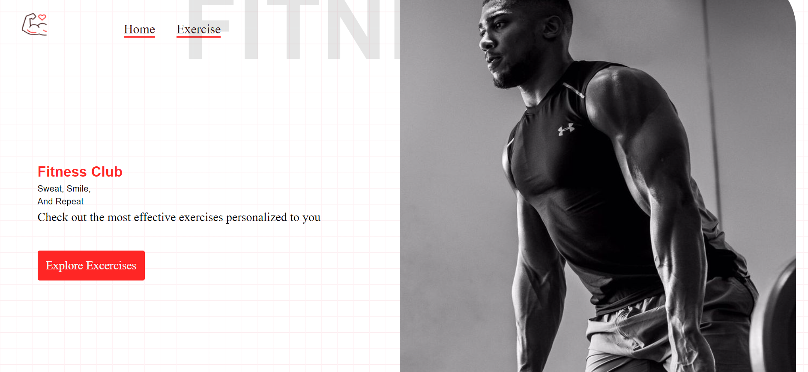

# 📋 APPENDIX



<p align="center">
  <!--  -->
  
  
  
</p>

1.🌲[INTRODUCTION](#introduction)\
\
2.💰[TECH STACK](#tech-stack)\
\
3.🏦[FEATURES](#features)\
\
4.🧾[INSTALLATION](#installation)

## 🌲INTRODUCTION

This is the Modern Ui Exercise Fitness App implenmented the Rapid Api ExerciseDB Api fetching the data from api

## 💰TECH-STACK

ReactJs\
Rapid Api\
Material UI

## 🏦FEATURES

\
👉\*_Topics_\*\
\
🎬 Personalized Topics suggestions from the Horizontal Sidebar , for displaying the exercise details with Similar exercises which can route to the youtube linke .\
\
👉**Home Page**\
\
🎬Showcases a visually appealing display of Various Number of exercises according to the need which fetched from a third-party API called Rapid Api ExercisesDB, providing a captivating introduction to the diverse range of exercises available which updates in continuously .\
\
👉\*\*Search functionality\*\*\
\
🔍 Efficient search functionality allows users to quickly find their personalized exercise or explore new titles.\

## INSTALLATION

Follow these steps to set up the project locally on your machine.
Install my-project with npm
Prerequisites
Make sure you have the following installed on your machine:

### Version Control with Git

- [Git Documentation](https://git-scm.com/doc)
- Official documentation for Git, the distributed version control system.

### Node.js

- [Node.js Official Website](https://nodejs.org/)
- Node.js is a JavaScript runtime built on Chrome's V8 JavaScript engine.

### npm (Node Package Manager)

- [npm Documentation](https://docs.npmjs.com/)
- Official documentation for npm, the package manager for Node.js.

```bash
npm install my-project
cd my-project
npm start
```
